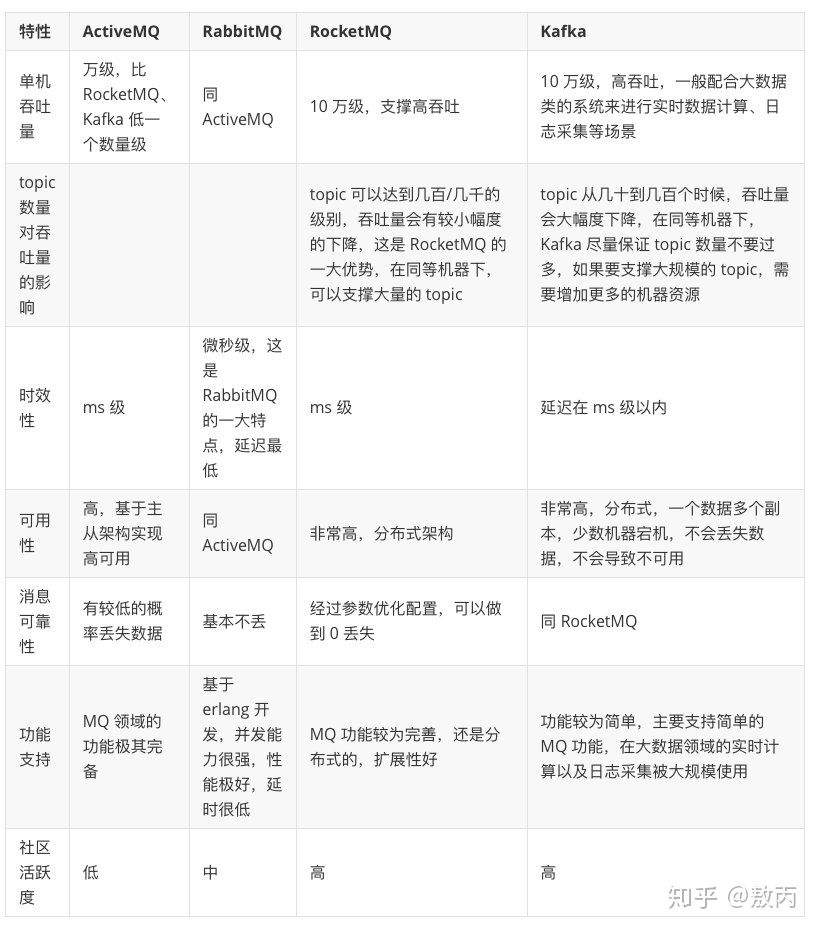

# kafka

## 一、消息系统简介

### 1.1 什么是消息系统
一个消息系统负责将数据从一个应用传递到另外一个应用，应用只需关注于数据，无需关注数据在两个或多个应用间是如何传递的。分布式消息传递基于可靠的消息队列，在客户端应用和消息系统之间异步传递消息。

### 1.2 消息传递模式
有两种主要的消息传递模式：点对点传递模式、发布-订阅模式。大部分的消息系统选用发布-订阅模式。Kafka就是一种发布-订阅模式。

#### 1.2.1 点对点传递模式
在点对点消息系统中，消息持久化到一个队列中。此时，将有一个或多个消费者消费队列中的数据。但是一条消息只能被消费一次。当一个消费者消费了队列中的某条数据之后，该条数据则从消息队列中删除。该模式即使有多个消费者同时消费数据，也能保证数据处理的顺序。

特点：生产者发送一条消息到queue，只有一个消费者能收到。
#### 1.2.2 发布订阅模式
在发布-订阅消息系统中，消息被持久化到一个topic中。与点对点消息系统不同的是，消费者可以订阅一个或多个topic，消费者可以消费该topic中所有的数据，同一条数据可以被多个消费者消费，数据被消费后不会立马删除。在发布-订阅消息系统中，消息的生产者称为发布者，消费者称为订阅者。

特点：发布者发送到topic的消息，只有订阅了topic的订阅者才会收到消息。

### 1.3 消息队列的优点

#### 1.3.1 异步
很多时候，用户不想也不需要立即处理消息。消息队列提供了异步处理机制，允许用户把一个消息放入队列，但并不立即处理它。想向队列中放入多少消息就放多少，然后在需要的时候再去处理它们。
#### 1.3.2 解耦
在项目启动之初来预测将来项目会碰到什么需求，是极其困难的。消息系统在处理过程中间插入了一个隐含的、基于数据的接口层，两边的处理过程都要实现这一接口。这允许你独立的扩展或修改两边的处理过程，只要确保它们遵守同样的接口约束。
#### 1.3.3 削峰
在访问量剧增的情况下，应用仍然需要继续发挥作用，但是这样的突发流量并不常见；如果为以能处理这类峰值访问为标准来投入资源随时待命无疑是巨大的浪费。使用消息队列能够使关键组件顶住突发的访问压力，而不会因为突发的超负荷的请求而完全崩溃。

#### 1.3.4 缓冲
在任何重要的系统中，都会有需要不同的处理时间的元素。例如，加载一张图片比应用过滤器花费更少的时间。消息队列通过一个缓冲层来帮助任务最高效率的执行———写入队列的处理会尽可能的快速。该缓冲有助于控制和优化数据流经过系统的速度。


#### 1.3.5 顺序保证
在大多使用场景下，数据处理的顺序都很重要。大部分消息队列本来就是排序的，并且能保证数据会按照特定的顺序来处理。Kafka保证一个Partition内的消息的有序性。
#### 1.3.6 扩展性
因为消息队列解耦了你的处理过程，所以增大消息入队和处理的频率是很容易的，只要另外增加处理过程即可。不需要改变代码、不需要调节参数。扩展就像调大电力按钮一样简单。

## 二、常用的消息队列中间件
### 2.1 RabbitMQ
RabbitMQ是使用Erlang编写的一个开源的消息队列，本身支持很多的协议：AMQP，XMPP, SMTP, STOMP，也正因如此，它非常重量级，更适合于企业级的开发。同时实现了Broker构架，这意味着消息在发送给客户端时先在中心队列排队。对路由，负载均衡或者数据持久化都有很好的支持。
### 2.2 Redis
Redis是一个基于Key-Value对的NoSQL数据库，开发维护很活跃。虽然它是一个Key-Value数据库存储系统，但它本身支持MQ功能，所以完全可以当做一个轻量级的队列服务来使用。对于RabbitMQ和Redis的入队和出队操作，各执行100万次，每10万次记录一次执行时间。测试数据分为128Bytes、512Bytes、1K和10K四个不同大小的数据。实验表明：入队时，当数据比较小时Redis的性能要高于RabbitMQ，而如果数据大小超过了10K，Redis则慢的无法忍受；出队时，无论数据大小，Redis都表现出非常好的性能，而RabbitMQ的出队性能则远低于Redis。
### 2.3 ActiveMQ
ActiveMQ是Apache下的一个子项目。 类似于ZeroMQ，它能够以代理人和点对点的技术实现队列。同时类似于RabbitMQ，它少量代码就可以高效地实现高级应用场景。
### 2.4 RocketMQ
RocketMQ是一个纯Java、分布式、队列模型的开源消息中间件，前身是MetaQ，是阿里参考Kafka特点研发的一个队列模型的消息中间件，后开源给apache基金会成为了apache的顶级开源项目，具有高性能、高可靠、高实时、分布式特点。
### 2.5 ZeroMQ
ZeroMQ号称最快的消息队列系统，尤其针对大吞吐量的需求场景。ZeroMQ能够实现RabbitMQ不擅长的高级/复杂的队列，但是开发人员需要自己组合多种技术框架，技术上的复杂度是对这MQ能够应用成功的挑战。ZeroMQ具有一个独特的非中间件的模式，你不需要安装和运行一个消息服务器或中间件，因为你的应用程序将扮演这个服务器角色。你只需要简单的引用ZeroMQ程序库，可以使用NuGet安装，然后你就可以愉快的在应用程序之间发送消息了。但是ZeroMQ仅提供非持久性的队列，也就是说如果宕机，数据将会丢失。其中，Twitter的Storm 0.9.0以前的版本中默认使用ZeroMQ作为数据流的传输（Storm从0.9版本开始同时支持ZeroMQ和Netty作为传输模块）。
### 2.6 Kafka
Kafka是Apache下的一个子项目，是一个高性能跨语言分布式发布/订阅消息队列系统，而Jafka是在Kafka之上孵化而来的，即Kafka的一个升级版。具有以下特性：快速持久化，可以在O(1)的系统开销下进行消息持久化；高吞吐，在一台普通的服务器上既可以达到10W/s的吞吐速率；完全的分布式系统，Broker、Producer、Consumer都原生自动支持分布式，自动实现负载均衡；支持Hadoop数据并行加载，对于像Hadoop的一样的日志数据和离线分析系统，但又要求实时处理的限制，这是一个可行的解决方案。Kafka通过Hadoop的并行加载机制统一了在线和离线的消息处理。Apache Kafka相对于ActiveMQ是一个非常轻量级的消息系统，除了性能非常好之外，还是一个工作良好的分布式系统。



## 三、Kafka
### 3.1 什么是Kafka
Kafka是最初由Linkedin公司开发，是一个分布式、分区的、多副本的、多订阅者，基于zookeeper协调的分布式日志系统（也可以当做MQ系统），常见可以用于web/nginx日志、访问日志，消息服务等等，Linkedin于2010年贡献给了Apache基金会并成为顶级开源项目。

主要应用场景是：日志收集系统和消息系统。

Kafka主要设计目标如下：

1) 以时间复杂度为O(1)的方式提供消息持久化能力，即使对TB级以上数据也能保证常数时间的访问性能。

2) 高吞吐率。即使在非常廉价的商用机器上也能做到单机支持每秒100K条消息的传输。

3) 支持Kafka Server间的消息分区，及分布式消费，同时保证每个partition内的消息顺序传输。

4) 同时支持离线数据处理和实时数据处理。

5) Scale out:支持在线水平扩展

### 3.2 Kafka术语
先介绍一下Kafka中的术语。下图展示了Kafka的相关术语以及之间的关系：

上图中一个topic配置了3个partition。Partition1有两个offset：0和1。Partition2有4个offset。Partition3有1个offset。副本的id和副本所在的机器的id恰好相同。

如果一个topic的副本数为3，那么Kafka将在集群中为每个partition创建3个相同的副本。集群中的每个broker存储一个或多个partition。多个producer和consumer可同时生产和消费数据。

#### 3.2.1 broker
Kafka 集群包含一个或多个服务器，服务器节点称为broker。

broker存储topic的数据。如果某topic有N个partition，集群有N个broker，那么每个broker存储该topic的一个partition。

如果某topic有N个partition，集群有(N+M)个broker，那么其中有N个broker存储该topic的一个partition，剩下的M个broker不存储该topic的partition数据。

如果某topic有N个partition，集群中broker数目少于N个，那么一个broker存储该topic的一个或多个partition。在实际生产环境中，尽量避免这种情况的发生，这种情况容易导致Kafka集群数据不均衡。
#### 3.2.2 topic
每条发布到Kafka集群的消息都有一个类别，这个类别被称为Topic。（物理上不同Topic的消息分开存储，逻辑上一个Topic的消息虽然保存于一个或多个broker上但用户只需指定消息的Topic即可生产或消费数据而不必关心数据存于何处）

类似于数据库的表名
#### 3.2.3 partition
topic中的数据分割为一个或多个partition。每个topic至少有一个partition。每个partition中的数据使用多个segment文件存储。partition中的数据是有序的，不同partition间的数据丢失了数据的顺序。如果topic有多个partition，消费数据时就不能保证数据的顺序。在需要严格保证消息的消费顺序的场景下，需要将partition数目设为1。
#### 3.2.4 producer 
生产者即数据的发布者，该角色将消息发布到Kafka的topic中。broker接收到生产者发送的消息后，broker将该消息追加到当前用于追加数据的segment文件中。生产者发送的消息，存储到一个partition中，生产者也可以指定数据存储的partition。
#### 3.2.5 consumer
消费者可以从broker中读取数据。消费者可以消费多个topic中的数据。
#### 3.2.6 consumer group
每个Consumer属于一个特定的Consumer Group（可为每个Consumer指定group name，若不指定group name则属于默认的group）。
#### 3.2.6 leader
每个partition有多个副本，其中有且仅有一个作为Leader，Leader是当前负责数据的读写的partition。
#### 3.2.6 follower
Follower跟随Leader，所有写请求都通过Leader路由，数据变更会广播给所有Follower，Follower与Leader保持数据同步。如果Leader失效，则从Follower中选举出一个新的Leader。当Follower与Leader挂掉、卡住或者同步太慢，leader会把这个follower从“in sync replicas”（ISR）列表中删除，重新创建一个Follower。

### 3.3 kafka简单使用
下载kafka
```
wget https://downloads.apache.org/kafka/3.0.0/kafka_2.13-3.0.0.tgz
tar -zxf kafka_2.13-3.0.0.tgz
cd kafka_2.13-3.0.0
```
启动zookeeper
```
bin/zookeeper-server-start.sh config/zookeeper.properties
```
启动kafka服务
```
bin/kafka-server-start.sh config/server.properties
```
创建topic
```
bin/kafka-topics.sh --create --topic quickstart-events --bootstrap-server localhost:9092 --partitions 3 --replication-factor 1
```
查看topic列表
```
bin/kafka-topics.sh --list --bootstrap-server localhost:9092
```
查看topic详情
```
bin/kafka-topics.sh --describe --topic quickstart-events --bootstrap-server localhost:9092
```
删除topic
```
bin/kafka-topics.sh --delete --topic quickstart-events --bootstrap-server localhost:909
```
以producer连接kafka
```
bin/kafka-console-producer.sh --topic quickstart-events --bootstrap-server localhost:9092
```
以consumer连接kafka
```
bin/kafka-console-consumer.sh --topic quickstart-events --from-beginning --bootstrap-server localhost:9092
```

## 四、kafka架构

### 1 架构


如上图所示，一个典型的Kafka集群中包含若干Producer（可以是web前端产生的Page View，或者是服务器日志，系统CPU、Memory等），若干broker（Kafka支持水平扩展，一般broker数量越多，集群吞吐率越高），若干Consumer Group，以及一个Zookeeper集群。Kafka通过Zookeeper管理集群配置，选举leader，以及在Consumer Group发生变化时进行rebalance。Producer使用push模式将消息发布到broker，Consumer使用pull模式从broker订阅并消费消息。


Topic在逻辑上可以被认为是一个queue，每条消费都必须指定它的Topic，可以简单理解为必须指明把这条消息放进哪个queue里。为了使得Kafka的吞吐率可以线性提高，物理上把Topic分成一个或多个Partition，每个Partition在物理上对应一个文件夹，该文件夹下存储这个Partition的所有消息和索引文件。创建一个topic时，同时可以指定分区数目，分区数越多，其吞吐量也越大，但是需要的资源也越多，同时也会导致更高的不可用性，kafka在接收到生产者发送的消息之后，会根据均衡策略将消息存储到不同的分区中。因为每条消息都被append到该Partition中，属于顺序写磁盘，因此效率非常高（经验证，顺序写磁盘效率比随机写内存还要高，这是Kafka高吞吐率的一个很重要的保证）。


对于传统的message queue而言，一般会删除已经被消费的消息，而Kafka集群会保留所有的消息，无论其被消费与否。当然，因为磁盘限制，不可能永久保留所有数据（实际上也没必要），因此Kafka提供两种策略删除旧数据。一是基于时间，二是基于Partition文件大小。例如可以通过配置$KAFKA_HOME/config/server.properties，让Kafka删除一周前的数据，也可在Partition文件超过1GB时删除旧数据，配置如下所示：
```dockerfile
# The minimum age of a log file to be eligible for deletion
log.retention.hours=168
# The maximum size of a log segment file. When this size is reached a new log segment will be created.
log.segment.bytes=1073741824
# The interval at which log segments are checked to see if they can be deleted according to the retention policies
log.retention.check.interval.ms=300000
# If log.cleaner.enable=true is set the cleaner will be enabled and individual logs can then be marked for log compaction.
log.cleaner.enable=false
```
因为Kafka读取特定消息的时间复杂度为O(1)，即与文件大小无关，所以这里删除过期文件与提高Kafka性能无关。选择怎样的删除策略只与磁盘以及具体的需求有关。另外，Kafka会为每一个Consumer Group保留一些metadata信息——当前消费的消息的position，也即offset。这个offset由Consumer控制。正常情况下Consumer会在消费完一条消息后递增该offset。当然，Consumer也可将offset设成一个较小的值，重新消费一些消息。因为offet由Consumer控制，所以Kafka broker是无状态的，它不需要标记哪些消息被哪些消费过，也不需要通过broker去保证同一个Consumer Group只有一个Consumer能消费某一条消息，因此也就不需要锁机制，这也为Kafka的高吞吐率提供了有力保障。

### 2 Producer消息路由
Producer发送消息到broker时，会根据Paritition机制选择将其存储到哪一个Partition。如果Partition机制设置合理，所有消息可以均匀分布到不同的Partition里，这样就实现了负载均衡。如果一个Topic对应一个文件，那这个文件所在的机器I/O将会成为这个Topic的性能瓶颈，而有了Partition后，不同的消息可以并行写入不同broker的不同Partition里，极大的提高了吞吐率。可以在$KAFKA_HOME/config/server.properties中通过配置项num.partitions来指定新建Topic的默认Partition数量，也可在创建Topic时通过参数指定，同时也可以在Topic创建之后通过Kafka提供的工具修改。

在发送一条消息时，可以指定这条消息的key，Producer根据这个key和Partition机制来判断应该将这条消息发送到哪个Parition。Paritition机制可以通过指定Producer的paritition. class这一参数来指定，该class必须实现kafka.producer.Partitioner接口。

### 3 Consumer Group
使用Consumer high level API时，同一Topic的一条消息只能被同一个Consumer Group内的一个Consumer消费，但多个Consumer Group可同时消费这一消息。


这是Kafka用来实现一个Topic消息的广播（发给所有的Consumer）和单播（发给某一个Consumer）的手段。一个Topic可以对应多个Consumer Group。如果需要实现广播，只要每个Consumer有一个独立的Group就可以了。要实现单播只要所有的Consumer在同一个Group里。用Consumer Group还可以将Consumer进行自由的分组而不需要多次发送消息到不同的Topic。

实际上，Kafka的设计理念之一就是同时提供离线处理和实时处理。根据这一特性，可以使用Storm这种实时流处理系统对消息进行实时在线处理，同时使用Hadoop这种批处理系统进行离线处理，还可以同时将数据实时备份到另一个数据中心，只需要保证这三个操作所使用的Consumer属于不同的Consumer Group即可。


## 五、kafka为什么比较快

Kafka 的消息是保存或缓存在磁盘上的，一般认为在磁盘上读写数据是会降低性能的，因为寻址会比较消耗时间，
但是实际上，Kafka 的特性之一就是高吞吐率。

### 1 顺序写入

Kafka 会把收到的消息都写入到硬盘中，它绝对不会丢失数据。为了优化写入速度 Kafka 采用了两个技术， 顺序写入和 MMFile（Memory Mapped File）。

磁盘读写的快慢取决于你怎么使用它，也就是顺序读写或者随机读写。在顺序读写的情况下，磁盘的顺序读写速度和内存持平。因为硬盘是机械结构，每次读写都会寻址->写入，其中寻址是一个“机械动作”，它是最耗时的。「所以硬盘最讨厌随机 I/O，最喜欢顺序 I/O」。为了提高读写硬盘的速度，Kafka 就是使用顺序 I/O。

而且 Linux 对于磁盘的读写优化也比较多，包括 read-ahead 和 write-behind，磁盘缓存等。

下图就展示了 Kafka 是如何写入数据的， 每一个 Partition 其实都是一个文件 ，收到消息后 Kafka 会把数据插入到文件末尾（虚框部分）：

这种方法有一个缺陷——没有办法删除数据 ，所以 Kafka 是不会删除数据的，它会把所有的数据都保留下来，每个 消费者（Consumer）对每个 Topic 都有一个 Offset 用来表示读取到了第几条数据 。

一般情况下 Offset 由客户端 SDK 负责保存 ，会保存到 Zookeeper 里面 。关于存在硬盘中的消息，Kafka 也有它的解决方法，可以基于时间和 Partition 文件的大小，正常 Kafka 是默认七天的保存，也可以通过命令来修改，以 users topic 为例。

所以，为了避免磁盘被撑满的情况，Kakfa 提供了两种策略来删除数据：

1) 「基于时间」 （默认七天）

2) 「基于 Partition 文件大小」

### 2 Memory Mapped Files

在大学的计算机原理里我们学过（划重点），mmf （Memory Mapped Files）直接利用操作系统的Page来实现文件到物理内存的映射，完成之后对物理内存的操作会直接同步到硬盘。mmf 通过内存映射的方式大大提高了IO速率，省去了用户空间到内核空间的复制。它的缺点显而易见--不可靠，当发生宕机而数据未同步到硬盘时，数据会丢失，Kafka 提供了produce.type参数来控制是否主动的进行刷新，如果 Kafka 写入到 mmf 后立即flush再返回给生产者则为同步模式，反之为异步模式。

Kafka 提供了一个参数 producer.type 来控制是不是主动 Flush：

如果 Kafka 写入到 mmf 之后就立即 Flush，然后再返回 Producer 叫同步 (Sync)。

如果 Kafka 写入 mmf 之后立即返回 Producer 不调用 Flush 叫异步 (Async)。


### 3 基于 Sendfile 实现零拷贝（Zero Copy）

作为一个消息系统，不可避免的便是消息的拷贝，常规的操作，一条消息，需要从创建者的socket到应用，再到操作系统内核，然后才能落盘。同样，一条消息发送给消费者也要从磁盘到内核到应用再到接收者的socket，中间经过了多次不是很有必要的拷贝。

传统 Read/Write 方式进行网络文件传输，在传输过程中，文件数据实际上是经过了四次 Copy 操作，其具体流程细节如下：

1) 调用 Read 函数，文件数据被 Copy 到内核缓冲区。

2) Read 函数返回，文件数据从内核缓冲区 Copy 到用户缓冲区

3) Write 函数调用，将文件数据从用户缓冲区 Copy 到内核与 Socket 相关的缓冲区。

4) 数据从 Socket 缓冲区 Copy 到相关协议引擎。

而 Sendfile 系统调用则提供了一种减少以上多次 Copy，提升文件传输性能的方法。在内核版本 2.1 中，引入了 Sendfile 系统调用，以简化网络上和两个本地文件之间的数据传输。Sendfile 的引入不仅减少了数据复制，还减少了上下文切换。相较传统 Read/Write 方式，2.1 版本内核引进的 Sendfile 已经减少了内核缓冲区到 User 缓冲区，再由 User 缓冲区到 Socket 相关缓冲区的文件 Copy。而在内核版本 2.4 之后，文件描述符结果被改变，Sendfile 实现了更简单的方式，再次减少了一次 Copy 操作。

Kafka 把所有的消息都存放在一个一个的文件中，当消费者需要数据的时候 Kafka 直接把文件发送给消费者，配合 mmap 作为文件读写方式，直接把它传给 Sendfile。

### 4 批量发送
Kafka允许进行批量发送消息，producter发送消息的时候，可以将消息缓存在本地，等到了固定条件发送到 Kafka 。

1) 等消息条数到固定条数。
2) 一段时间发送一次。

### 5 数据压缩

Kafka还支持对消息集合进行压缩，Producer可以通过GZIP或Snappy格式对消息集合进行压缩。压缩的好处就是减少传输的数据量，减轻对网络传输的压力。

Producer压缩之后，在Consumer需进行解压，虽然增加了CPU的工作，但在对大数据处理上，瓶颈在网络上而不是CPU，所以这个成本很值得。

注意：「批量发送」和「数据压缩」一起使用，单条做数据压缩的话，效果不明显