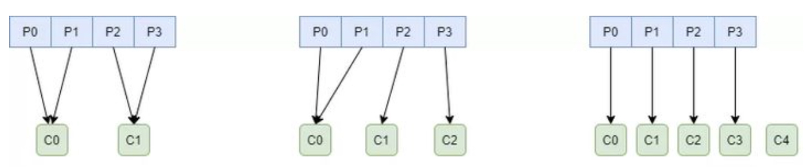

## kafka 

## 消费者组

什么是consumer group? consumer group是kafka提供的可扩展且具有容错性的消费者机制。一个消费者组内有多个消费者，它们共享一个公共的ID，即group ID。组内的所有消费者协调在一起来消费订阅主题的所有分区。当然，每个分区只能由同一个消费组内的一个consumer来消费。总结：

- consumer group下可以有一个或多个consume
- group.id是一个字符串，唯一标识一个consumer group
- consumer group下订阅的topic下的每个分区只能分配给某个group下的一个consumer(当然该分区还可以被分配给其他group)

### **Rebalance**

rebalance本质上是一种协议，规定了一个consumer group下的所有consumer如何达成一致来分配订阅topic的每个分区。比如某个group下有20个consumer，它订阅了一个具有100个分区的topic。正常情况下，Kafka平均会为每个consumer分配5个分区。这个分配的过程就叫rebalance。

**Rebalance触发条件：**

* 消费者组成员数量发生变更（消费者进入组，消费者主动离开组，消费者崩溃）
* 订阅主题数量发生变更
* 订阅主题的分区发生变更

### 分区策略

kafka提供了三种分区分配策略：

* **RangeAssignor**

  RangeAssignor对每个Topic进行独立的分区分配。对于每一个Topic，首先对分区按照分区ID进行排序，然后订阅这个Topic的消费组的消费者再进行排序，之后尽量均衡的将分区分配给消费者。这里只能是尽量均衡，因为分区数可能无法被消费者数量整除，那么有一些消费者就会多分配到一些分区。分配示意图如下：

  

  这种分配方式随着订阅的topic数量的增多，会使得不同消费者之间的不均衡问题越来越严重：

  

* **RoundRobinAssignor**

  RoundRobinAssignor的分配策略是将消费组内订阅的所有Topic的分区及所有消费者进行排序后尽量均衡的分配。如果消费组内，消费者订阅的Topic列表是相同的（每个消费者都订阅了相同的Topic），那么分配结果是尽量均衡的（消费者之间分配到的分区数的差值不会超过1）。如果订阅的Topic列表是不同的，那么分配结果是不保证“尽量均衡”的，因为某些消费者不参与一些Topic的分配。

  

  如果消费者c0、c1、c2都订阅了T0和T1两个topic，采用该策略则三个消费者消费分区的差值不会超过1相较于**RangeAssignor**更加均衡。但如果三者订阅的topic数量不一致，也会存在不均衡的问题，如图所示：

  

* **StickyAssignor**

  其目的是在执行一次新的分配时，能在上一次分配的结果的基础上，尽量少的调整分区分配的变动，节省因分区分配变化带来的开销。Sticky是“粘性的”，可以理解为分配结果是带“粘性的”——每一次分配变更相对上一次分配做最少的变动。其目标有两点：

  - 分区的分配尽量的均衡。
  - 每一次重分配的结果尽量与上一次分配结果保持一致。

  当这两个目标发生冲突时，优先保证第一个目标。第一个目标是每个分配算法都尽量尝试去完成的，而第二个目标才真正体现出StickyAssignor特性的。

  

## kafak消息丢失

### broker丢失消息

kafka为了得到更高的性能和吞吐量，将数据异步批量的存储在磁盘中。消息的刷盘过程，为了提高性能，减少刷盘次数，kafka采用批量刷盘的方法将消息进行持久化操作，在接收到消息后，会将消息存储至page cache中，按照一定的规则触发刷盘操作。一旦在刷盘之前系统挂掉，那么就会丢失page cache中的数据，导致消息丢失。刷盘的触发条件有三种：

* 主动调用刷盘操作
* 可用内存低于阈值
* 时间达到一定阈值

理论上讲，是无法保证单个broker丢失数据是无法做到的，只能通过配置刷盘机制的参数缓解该情况（如：时间间隔、内存占用阈值），但可靠性和效率往往是成反比的。

**解决方案**

可以通过broker和producer协同来解决该问题，需要producer在发送消息至broker时，进行确认消息是否发送成功。需要通过配置producer的acks参数来决定producer发送消息至broker之后的确认策略：

| acks |                                                  |
| ---- | ------------------------------------------------ |
| 0    | producer不需要等待确认信息，效率高，但可靠性较差 |
|1|leader接收到消息后，不等待其他follower的响应就返回确认信息。如果响应消息之后但follower还未复制之前leader立即故障，那么消息将会丢失。|
|all/-1|leader接受消息后，需要完成ISR(In-Sync Replica,与leader始终保持同步的副本)列表中follower的数据同步才会返回确认信息。但如果ISR中只有leader自己，此时等同于acks=1的情况，需要broker的min.insync.replicas参数来设定最小的ISR数。|

一旦producer发现消息丢失，会进行重试，重试的次数由retries参数决定，如果超过重试次数依旧没有成功那么就必须由producer的客户端来进行处理。

### consumer丢失消息

consumer丢失消息的情况则出现的更加频繁，在消费者消费完消息后应当提交offset用于调整消费的位置，有两种方式：

* 自动提交

  根据一定的时间间隔，将收到的消息进行提交，提交的过程与消费过程异步，可能会出现，消费失败但提交offset，会导致消息丢失，也会出现消费成功但提交offset失败，导致重复消费。

* 手动提交

  在对消息完成消费之后，有consumer进行提交offset，可以保证消息至少被消费一次，同样也存在重复消费的问题。